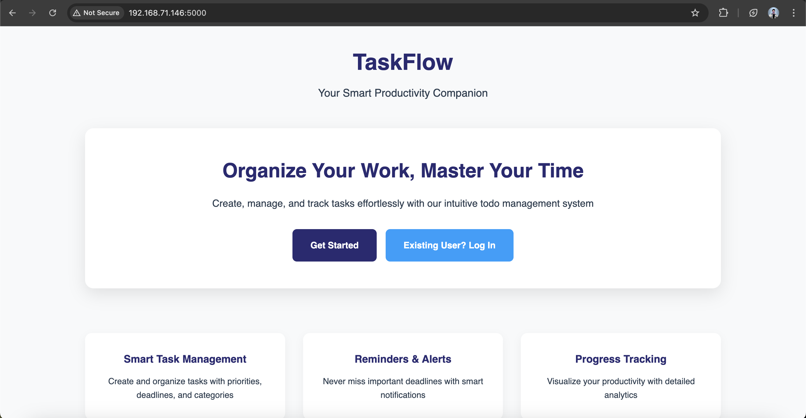
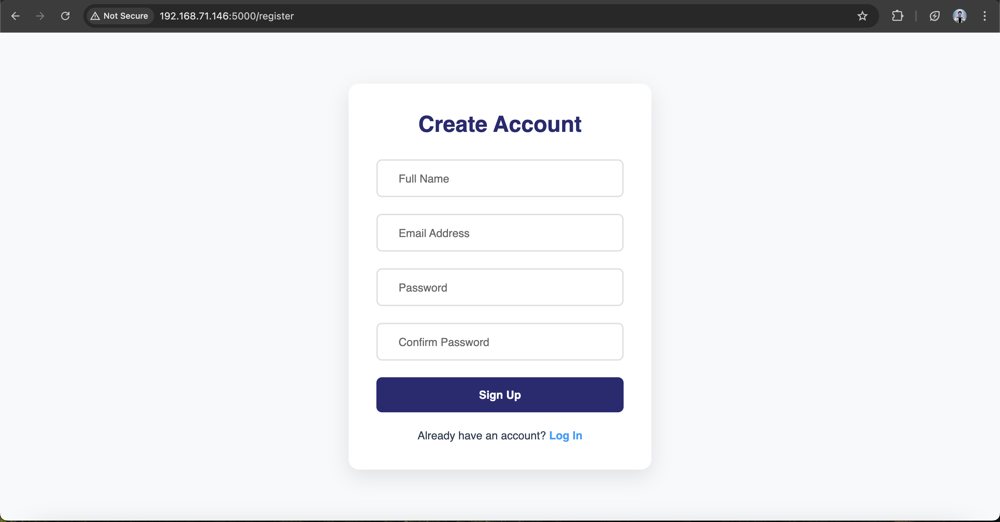
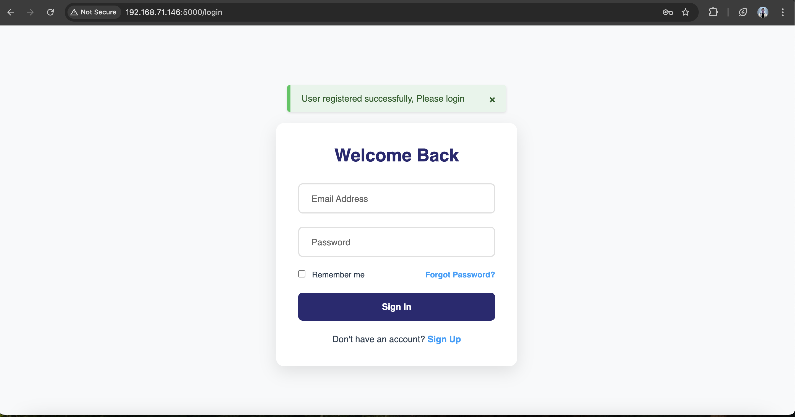
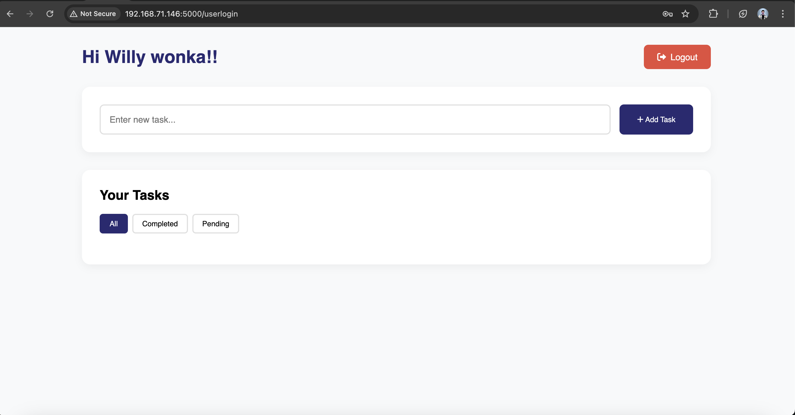
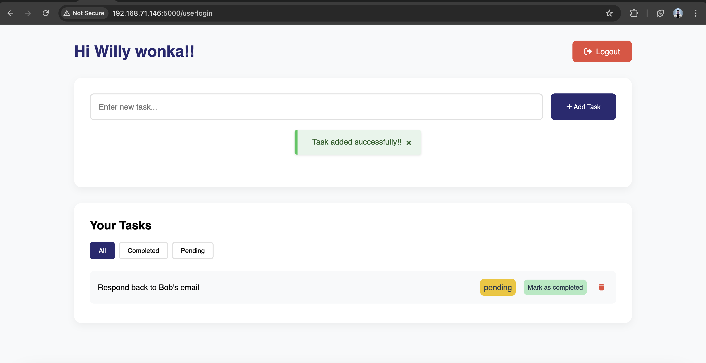
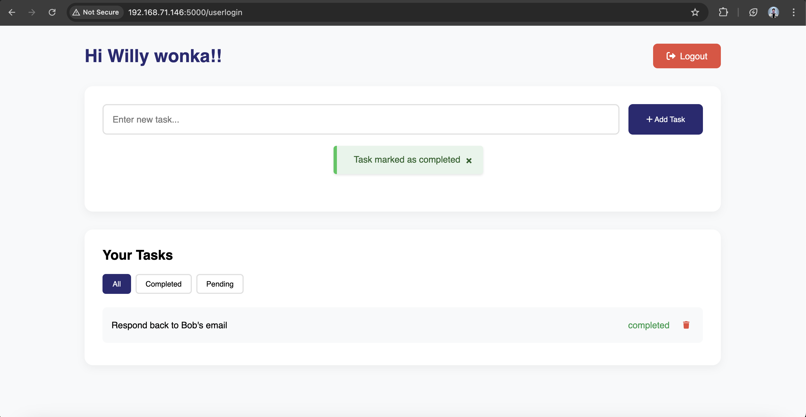
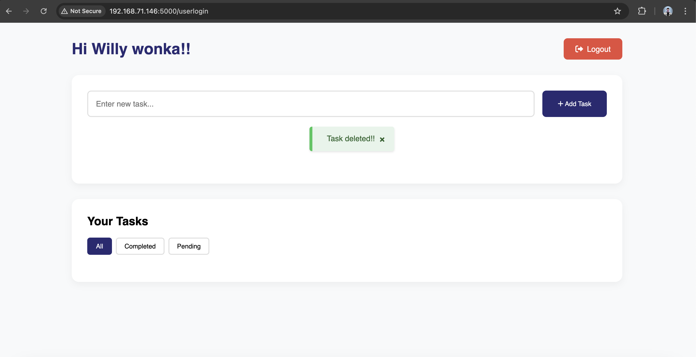

# TODO application
## Overview
A simple todo application built with flask and SQLite that allows users to -
* Register and login securely to the application
* Create and manage your todo tasks
* View, add and delete tasks
* All pending and completed tasks are listed automatically
* on completion of task, you can mark a task as completed
* if required you can delete the task as well.

## Features
### Authentication
* Secure registration and authentication of the user.
* Session based login/logout functionality

### TASK Management
* Add new tasks with simple text input
* One click mark task as completed
* One click permanently deletion of task
* User can only see their own tasks hence acheived user isolation

## Technical Stack
**Backend**: Python Flask
**Database**: SQLite (file based)
**Frontend**: HTML5, CSS3
**Templating**: Jinja2

## File Structure
```
todo-app/
├── app.py                # Main application file
├── todo.db               # SQLite database file
├── requirements.txt      # Python dependencies
├── static/
│   ├── registerUser.css  # CSS stylesheet for user registration form
│   ├── userhome.css      # CSS stylesheet for user home page
│   ├── userlogin.css     # CSS stylesheet for user login page
│   └── styles.css        # CSS stylesheet for landing page
└── templates/
    ├── index.html        # welcome page
    ├── registerUser.html # User registration page 
    ├── userhome.html     # User Home page
    └── userlogin.html    # Login page 
```

## Installation guide
1. Clone the repository
   ```
   git clone https://github.com/dpdeepankar/python-todoapp.git
   cd python-todoapp
   ```

2. Install dependencies
   ```
   python3 -m pip install -r requirements.txt
   ```

3. Run the app
   ```
   python3 app.py
   ```

4. Access the application on web browser.
   

5. Click on Get Started to register a new user.
   

6. Fill in the details and click on Sign Up, and you will be redirected to the login page.
   

7. Fill in the login form and click on Sign In and you will be land up on the user home page.
   

8. Enter the details of the task in the input field and click on Add Task button. Once added, you can see the task and it status.
   

9. Once the task is completed you can mark it as completed by clicking on the green button that says *mark as completed*.
   

10. To delete the task, click on the small bin icon at the end of the task on the right nside the status of the task.
   

11. Once done, you can logout of the application by clicking on the logout button and you will land on the welcome page again.

    
   
