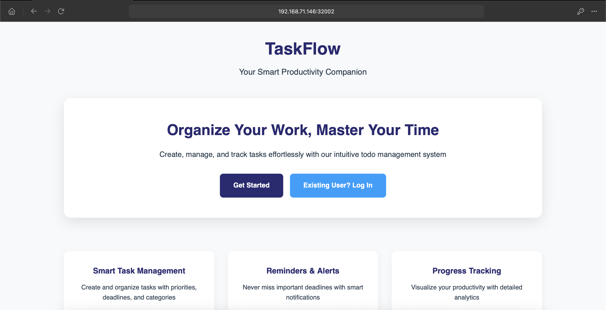
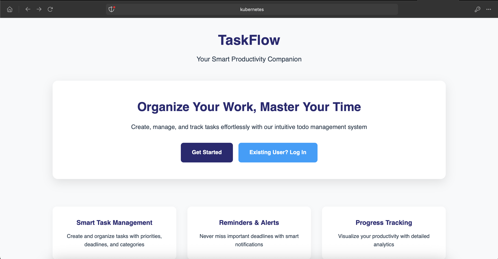

# TODO application
## Overview
A simple todo application built with flask and SQLite that allows users to -
* Register and login securely to the application
* Create and manage your todo tasks
* View, add and delete tasks
* All pending and completed tasks are listed automatically
* on completion of task, you can mark a task as completed
* if required you can delete the task as well.

## Features
### Authentication
* Secure registration and authentication of the user.
* Session based login/logout functionality

### TASK Management
* Add new tasks with simple text input
* One click mark task as completed
* One click permanently deletion of task
* User can only see their own tasks hence acheived user isolation

## Technical Stack
**Backend**: Python Flask
**Database**: SQLite (file based)
**Frontend**: HTML5, CSS3
**Templating**: Jinja2

## File Structure
```
todo-app/
├── app.py                # Main application file
├── todo.db               # SQLite database file
├── requirements.txt      # Python dependencies
├── static/
│   ├── registerUser.css  # CSS stylesheet for user registration form
│   ├── userhome.css      # CSS stylesheet for user home page
│   ├── userlogin.css     # CSS stylesheet for user login page
│   └── styles.css        # CSS stylesheet for landing page
└── templates/
    ├── index.html        # welcome page
    ├── registerUser.html # User registration page 
    ├── userhome.html     # User Home page
    └── userlogin.html    # Login page 
```

## Installation guide
1. Clone the repository
   ```
   git clone https://github.com/dpdeepankar/python-todoapp.git
   cd python-todoapp
   ```

2. Install dependencies
   ```
   python3 -m pip install -r requirements.txt
   ```

3. Run the app
   ```
   python3 app.py
   ```

4. Access the application on web browser.
   

5. Click on Get Started to register a new user.
   

6. Fill in the details and click on Sign Up, and you will be redirected to the login page.
   

7. Fill in the login form and click on Sign In and you will be land up on the user home page.
   

8. Enter the details of the task in the input field and click on Add Task button. Once added, you can see the task and it status.
   

9. Once the task is completed you can mark it as completed by clicking on the green button that says *mark as completed*.
   

10. To delete the task, click on the small bin icon at the end of the task on the right nside the status of the task.
   

11. Once done, you can logout of the application by clicking on the logout button and you will land on the welcome page again.


## Dockerize the app
I have added Dockerfile to dockerize the app. Use the docker file to create a docker image and deploy on docker/kubernetes. Since we used python alpine image as the base image for our application notice how small our app image is.

```
$ docker build -t python-todoapp:v1 ${PWD} 
[+] Building 8.8s (9/9) FINISHED                                                                                                                                                             docker:default
 => [internal] load build definition from Dockerfile                                                                                                                                                   0.0s
 => => transferring dockerfile: 435B                                                                                                                                                                   0.0s
 => [internal] load metadata for docker.io/library/python:3.9.22-alpine3.21                                                                                                                            3.0s
 => [internal] load .dockerignore                                                                                                                                                                      0.0s
 => => transferring context: 2B                                                                                                                                                                        0.0s
 => [1/4] FROM docker.io/library/python:3.9.22-alpine3.21@sha256:c549d512f8a56f7dbf15032c0b21799f022118d4b72542b8d85e2eae350cfcd7                                                                      0.0s
 => [internal] load build context                                                                                                                                                                      0.0s
 => => transferring context: 54.99kB                                                                                                                                                                   0.0s
 => CACHED [2/4] WORKDIR /app                                                                                                                                                                          0.0s
 => [3/4] COPY . /app                                                                                                                                                                                  0.0s
 => [4/4] RUN python -m pip install --no-cache-dir -r requirements.txt                                                                                                                                 5.6s
 => exporting to image                                                                                                                                                                                 0.1s
 => => exporting layers                                                                                                                                                                                0.1s
 => => writing image sha256:72407b323e7ce8d89d34e18f171c55d555fe46e14d1d1dd11317f1ddcac5954f                                                                                                           0.0s
 => => naming to docker.io/library/python-todoapp


# check the newly created docker image.
$ docker images
REPOSITORY          TAG       IMAGE ID       CREATED          SIZE
python-todoapp:v1   latest    72407b323e7c   35 seconds ago   69.4MB

```

## Deploy app on docker
Now its time to deploy our app and then access it on browser. We are your host port binding and thus our app will be accessible on port 32002 of the host.

```
$ docker run -d -p 32002:5000 python-todoapp:v1
fe514af317da97022456519dd047eba6950cb3f84d7ff07d75603f37133880fe

$ docker ps
CONTAINER ID   IMAGE            COMMAND              CREATED          STATUS          PORTS                                           NAMES
fe514af317da   python-todoapp   "python -u app.py"   25 seconds ago   Up 25 seconds   0.0.0.0:32002->5000/tcp, [::]:32002->5000/tcp   festive_maxwell
```

Let's go over the browser and browse to our host IP and port 32002. 
URL: http://hostip:32002



## Running app on KinD cluster.

So far we have seen runing app locally as well as as a docker container. Now lets deploy it on a container orchestrator like Kubernetes. We are using KinD cluster to demonstrate this use case.

If you would like to setup KinD cluster you can follow steps given on <a href=kind-cluster-setup/README.md> here</a>

First lets load the created docker image on KinD cluster. Important to note is that KinD do not behave well with the latest tag so tag your image anything but latest.

```Load Docker image to KinD
kind load docker-image python-todoapp:v1
```

* Lets use the helm chart in the repo to deploy the application. Update line number 10 and 14 with the image name and tag that you have created.

```
image:
  repository: python-todoapp
  # This sets the pull policy for images.
  pullPolicy: IfNotPresent
  # Overrides the image tag whose default is the chart appVersion.
  tag: "v1"
```

```Deploy Helm Chart
helm upgrade -i python-todoapp -n default helm/python-todo-app/
```

Lets verify the components that our helm chart has deployed and see if the application is running.
```
$ kubectl get pods
NAME                                              READY   STATUS    RESTARTS   AGE
python-todoapp-python-todo-app-6987485587-md8kw   1/1     Running   0          11m

$ kubectl get svc
NAME                             TYPE        CLUSTER-IP     EXTERNAL-IP   PORT(S)   AGE
kubernetes                       ClusterIP   10.96.0.1      <none>        443/TCP   102m
python-todoapp-python-todo-app   ClusterIP   10.96.41.251   <none>        80/TCP    14m

$ kubectl get ingress
NAME                             CLASS   HOSTS        ADDRESS     PORTS   AGE
python-todoapp-python-todo-app   nginx   kubernetes   localhost   80      14m

```

Nginx only responds to request with a proper URL it won't work on the ip address. In the above output see the name in ADDRESS column, this is what you need to set in /etc/hosts file of your host machine running KinD cluster.

```
echo <host_ip> <address> >> /etc/hosts
```

Now we can access it using the host name on url http://kubernetes




    
   
